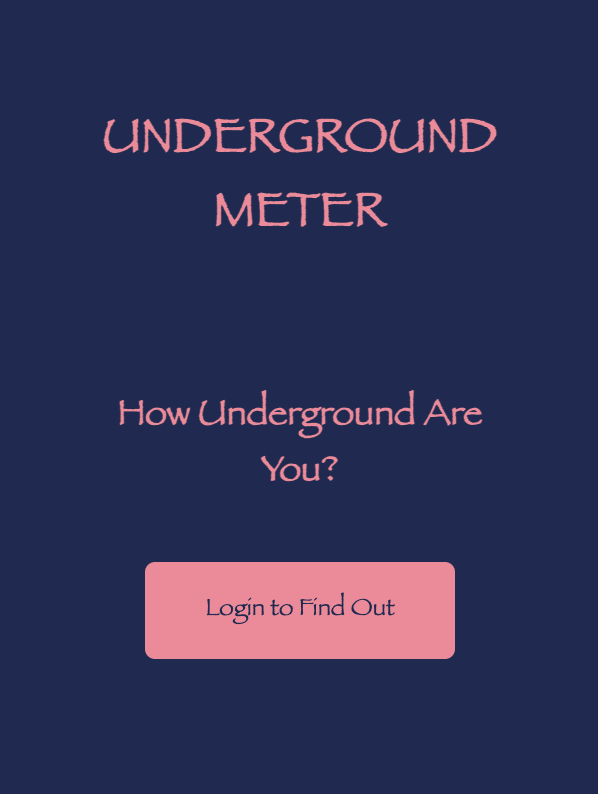
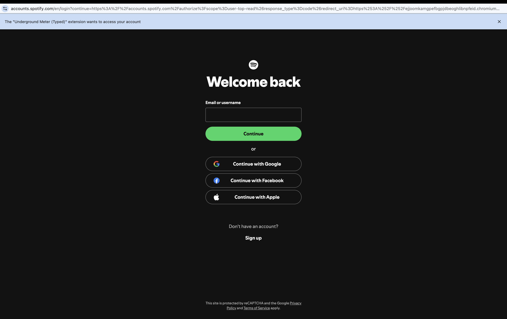

# Underground Meter — UCLA Radio Chrome Extension

A Chrome extension that connects to **Spotify** to help UCLA Radio listeners track their listening habits, discover underground artists, and visualize their daily music “meter.”

> **Tech Stack:** JavaScript · Chrome Extensions API · Spotify Web API (OAuth) · HTML/CSS

---

## 🚀 Overview

Underground Meter is a lightweight Chrome extension built for **UCLA Radio** to enhance music discovery and listener engagement.

Using Spotify OAuth, the extension retrieves the user’s currently playing track and displays curated metadata such as:

- Artist background
- Track energy & vibe indicators
- Discoverability score
- Underground artist highlights
- Listening streaks or daily “meter”

This project aims to make discovering underground music effortless and fun — directly from your browser.

---

## ✨ Features

- 🔐 **Spotify OAuth Login** — Secure sign-in using Spotify’s Web API authorization flow.
- 🎧 **Now Playing Widget** — Displays track, artist, and album cover in real time.
- 📈 **Underground Meter Score** — Generates a simple meter based on genre rarity and listening patterns.
- 🌐 **Clean, Minimal UI** — Designed for quick interaction inside the popup.
- ⚡ **Lightweight** — Runs entirely in the browser.

---

## 🖼️ Screenshots

| Popup UI | OAuth Login |
|----------|-------------|
|  |  |

---

## 🛠️ Installation (Developer Mode)

1. Clone this repository:
   ```bash
   git clone https://github.com/your-username/underground-meter.git
   cd underground-meter
2. Open Chrome and navigate to:
   chrome://extensions/
3. Enable Developer Mode (top right).
4. Click Load unpacked.  
5. Select the project folder.
  The extension should now appear in your toolbar 🎉

---

##🔧 Configuration
1. Create a Spotify App
Visit: https://developer.spotify.com/dashboard
* Create a new app
* Add redirect URI:
https://<your-extension-id>.chromiumapp.org/

2. Add your Spotify keys
Create config.js (if it doesn’t exist):
```js
export const CLIENT_ID = "your_spotify_client_id";
export const REDIRECT_URI = "chrome-extension://<extension-id>/callback.html";
```

---

## 📁 Project Structure
```arduino
underground-meter/
│── manifest.json
│── popup.html
│── popup.js
│── background.js
│── auth.js
│── styles/
│     └── popup.css
│── assets/
│     └── icons/
│── screenshots/
└── README.md
```
---

## 🎨 UI/UX Notes
* Simple, minimal popup UI
* High contrast for album art
* Design loosely follows UCLA Radio branding
* Built for quick glanceability

---

## 🧩 Future Improvements
* Artist history + top tracks
* Weekly listening summary
* Graph visualizations (D3.js / Chart.js)
* Similar underground artist recommendations
* Dark/light mode toggle

---

## 🤝 Contributors
Ellen Chen — Developer & UI/UX\
Samantha Shon — Developer & UI/UX\
UCLA Radio
